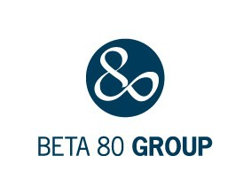

# **WEBINAR 2: ROAD TO CLOUD**
Per lanciare l'intero stack e distribuire un sito WordPress su AWS, fate clic su uno dei link di lancio dello stack qui sotto o scaricate il modello Master e lanciatelo localmente.

È possibile avviare questo stack CloudFormation, utilizzando il proprio account

## Overview

| Component | step | Launch |
| --- | --- | ---
|crea l'infrastruttura nella region us-east-1 | step 1 |  |
|crea il file system condiviso nella region us-east-1 | step 2|  |
|istanzia un wordpress site in high avaibility nella region us-east-1 | step 3|  |
|aggiorna il record DNS nella region us-east-1 | step 4|  |
| --------------------------------------------| -----| --------------------------------- |
|crea l'infrastruttura nella region eu-west-1 | step 1 |  |
|crea il file system condiviso nella region eu-west-1 | step 2|  |
|istanzia un wordpress site in high avaibility nella region eu-west-1 | step 3|  |
|aggiorna il record DNS nella region eu-west-1 | step 4|  |
| --------------------------------------------| -----| --------------------------------- |
|main template eseguibile nella region us-east-1 | step 1 |  |
### Input Parameters

#### General AWS
- Coppia di nomi di chiavi EC2
- Blocco CIDR di accesso SSH (per accedere all'host bastione)
- Indirizzo e-mail per l'amministrazione di WordPress e per le notifiche SNS
- Nome di dominio del sito (ad es. 'example.com') - utilizzare solo se si utilizza un nome di dominio personalizzato.
- Selezionare se si desidera creare un record DNS per il nome di dominio personalizzato.
- Selezionare se si desidera utilizzare AWS CloudFront per memorizzare le immagini nella cache presso le postazioni edge di AWS (per utilizzare un CDN sono necessari plugin di terze parti).
- Inserire l'ARN del certificato AWS Certificate Manager creato in us-east-1 per il nome di dominio del sito personalizzato

#### Rete
- Numero di zone di disponibilità (AZ) - da 2 a 6
- Selezionare le singole Availability Zone in cui verranno lanciate le risorse (il numero di AZ selezionate deve corrispondere al numero di AZ selezionato in precedenza).
- Blocco CIDR della VPC
- Tenancy VPC
- Blocco CIDR per le sottoreti pubbliche da 1 a 6
- Blocco CIDR per le sottoreti web da 1 a 6
- Blocco CIDR per sottoreti dati da 1 a 6

#### File System
- Modalità di prestazione Amazon EFS
- File system crittografato (booleano)
- AWS KMS Customer Master Key ARN (se si abilita la crittografia e si usa la CMK gestita dal cliente)
- Clonare EFS, utilizzare l'ID di sistema di un filesystem EFS esistente. I dati vengono copiati nella Site Directory. Se la directory del sito esiste sul filesystem di origine, viene copiato solo il contenuto della directory del sito. Quindi, se si sta copiando da un modello Wordpress Cloudformation esistente, assicurarsi che la directory del sito sia la stessa.
- Aggiungete dati fittizi al file system per ottenere un throughput e un IOPS superiori alla quantità di dati che l'ambiente WordPress utilizzerà. Questo valore è espresso in GiB.
- Il tipo di istanza che verrà utilizzata per aggiungere dati fittizi al file system.
- Selezionare se si desidera creare allarmi che inviino notifiche SNS quando il saldo del credito burst del file system scende al di sotto di determinate soglie.
- Il tipo di istanza che verrà utilizzata per regolare dinamicamente le soglie di allarme al variare del throughput consentito.
- La soglia 'Warning' ha un valore predefinito di 180 minuti. Ciò significa che un allarme CloudWatch invierà una notifica via e-mail 180 minuti prima che il saldo del credito scenda a zero, in base all'ultimo tasso di throughput consentito.
- La soglia 'Critico' ha un valore predefinito di 60 minuti. Ciò significa che un allarme di CloudWatch invierà una notifica via e-mail 60 minuti prima che il saldo del credito scenda a zero, in base all'ultimo tasso di throughput consentito.

#### Database 
- Nome del database
- Nome utente master del database
- Password master del database
- DB Restore from Snapshot, inserire il nome dell'istantanea del cluster dalla console RDS. (formattato rds:wordpress-stack-name-rds-xxxxxxxx-databasecluster-apzdbrozmzcn-snapshot-date)
- Dimensione del database
- Istanza di database Tipo di classe
- Archiviazione crittografata del database (booleano)
- AWS KMS Customer Master Key ARN (se si abilita la crittografia e si usa la CMK gestita dal cliente)
- Crea cluster ElastiCache (booleano)
- Tipo di nodo ElastiCache

#### Parametri di Bastion
- Tipo di istanza Bastion

#### Bastion Parameters
- Bastion Instance Type

#### Web Parameters
- PHP Version (5.6, 7.0, or 8.0 - recomended)
- Web Instance Type
- The maximum number of instances in the web tier auto scaling group
- The minimum (and desired) number of instances in the web tier auto scaling group

#### WordPress Parameters
- WordPress Title
- WordPress Administrator Username
- WordPress Administrator Username Password
- WordPress Main Language of the site
- Wordpress Site Directory
