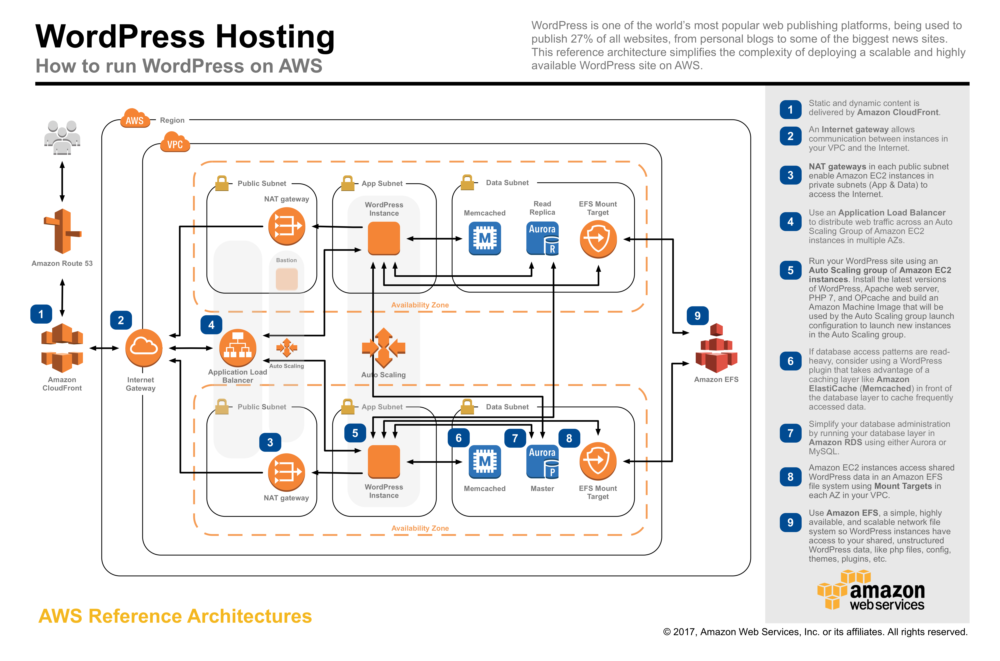

# **WEBINAR 2: ROAD TO CLOUD**
To launch the entire stack and deploy a WordPress site on AWS, click on one of the ***Launch Stack*** links below or download the Master template and launch it locally.

You can launch this CloudFormation stack, using your account

## Overview

| Component | step | Launch |
| --- | --- | ---
|crea l'infrastruttura nella region us-east-1 | step 1 |  |
|crea il file system condiviso nella region us-east-1 | step 2|  |
|istanzia un wordpress site in high avaibility nella region us-east-1 | step 3|  |
|aggiorna il record DNS nella region us-east-1 | step 4|  |
| --------------------------------------------| -----| --------------------------------- |
|crea l'infrastruttura nella region eu-west-1 | step 1 |  |
|crea il file system condiviso nella region eu-west-1 | step 2|  |
|istanzia un wordpress site in high avaibility nella region eu-west-1 | step 3|  |
|aggiorna il record DNS nella region eu-west-1 | step 4|  |
| --------------------------------------------| -----| --------------------------------- |
|main template eseguibile nella region us-east-1 | step 1 |  |
### Input Parameters

#### General AWS
- EC2 Key Name Pair
- SSH Access CIDR block (to access bastion host)
- Email address for WordPress administration and SNS notifications
- Site Domain Name (e.g. 'example.com') - use this only if you will use your own custom domain name
- Select if you want to create a DNS record set for your custom dist domain name
- Select if you want to use a AWS CloudFront to cache images at AWS edge locations (3rd party plugins are required to leverage a CDN)
- Enter the ARN of the AWS Certificate Manager certificate you created in us-east-1 for your custom site domain name

#### Network
- Number of Avilability Zones (AZs) - from 2 to 6
- Select the individual Availability Zones where resources will be launched (the number of selected AZs must match the number of AZs selected above)
- VPC CIDR block
- VPC tenancy
- CIDR block for public subnets 1 to 6
- CIDR block for web subnets 1 to 6
- CIDR block for data subnets 1 to 6

#### File System
- Amazon EFS performance mode
- Encrypted file system (boolean)
- AWS KMS Customer Master Key ARN (if enabling encryption and using customer-managed CMK)
- Clone EFS, use the System ID of an existing EFS Filesystem. The data is copied to the Site Directory. If the Site Directory exists on the source filesystem, only the contents of the site directory are copied. So make sure if you are copying from an existing Wordpress Cloudformation template, that the site directory is the same.
- Add dummy data to the file system to achieve higher throughput & IOPS beyond the amount of data your WordPress environment will use. This value is in GiB.
- The instance type that will be used to dd dummy data into the file system
- Select if you want to create alarms that send SNS notifications when the file system's burst credit balance drops below certain thresholds.
- The instance type that will be used to dynamically adjust alarm thresholds as permitted throughput changes.
- The 'Warning' threshold has a default value of 180 minutes. This means that a CloudWatch alarm will send an email notification 180 minutes before the credit balance drops to zero, based on the latest permitted throughput rate.
- The 'Critical' threshold has a default value of 60 minutes. This means that a CloudWatch alarm will send an email notification 60 minutes before the credit balance drops to zero, based on the latest permitted throughput rate.

#### Database
- Database Name
- Database Master Username
- Database Master Password
- DB Restore from Snapshot, enter the cluster Snapshot name from the RDS console. (formatted rds:wordpress-stack-name-rds-xxxxxxxx-databasecluster-apzdbrozmzcn-snapshot-date)
- Database Size
- Database Instance Class Type
- Encrypted database storage (boolean)
- AWS KMS Customer Master Key ARN (if enabling encryption and using customer-managed CMK)
- Create ElastiCache cluster (boolean)
- ElastiCache Node Type

#### Bastion Parameters
- Bastion Instance Type

#### Web Parameters
- Create CloudFront distribution (boolean)
- Create Route 53 record set (boolean)
- PHP Version (5.5, 5.6, or 7.0 - recomended)
- Web Instance Type
- The maximum number of instances in the web tier auto scaling group
- The minimum (and desired) number of instances in the web tier auto scaling group

#### WordPress Parameters
- WordPress Title
- WordPress Administrator Username
- WordPress Administrator Username Password
- WordPress Main Language of the site
- Wordpress Site Directory
